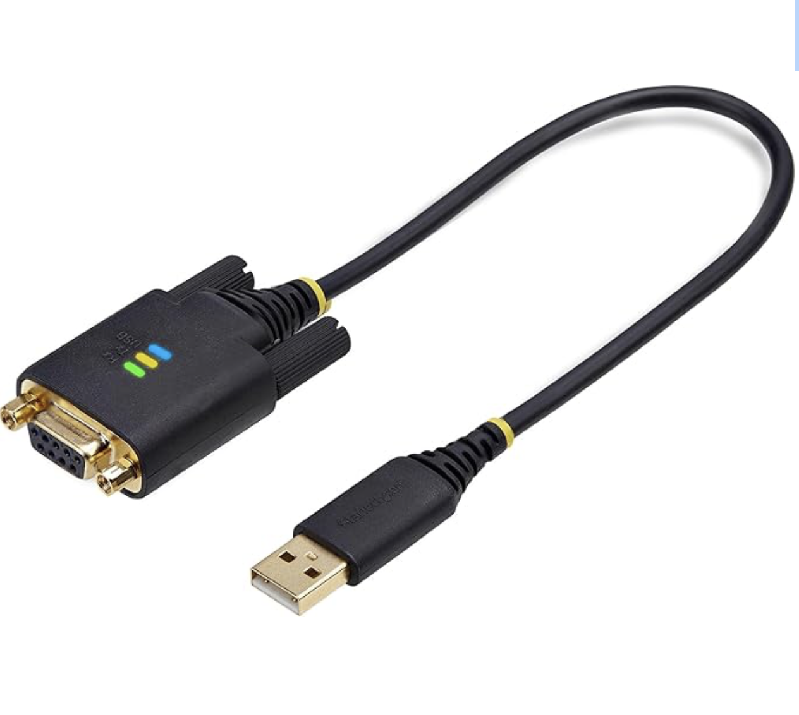
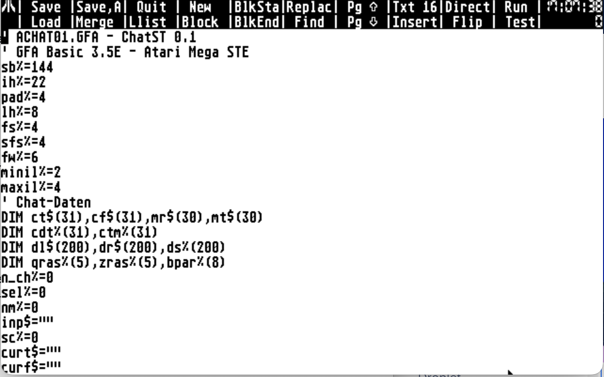
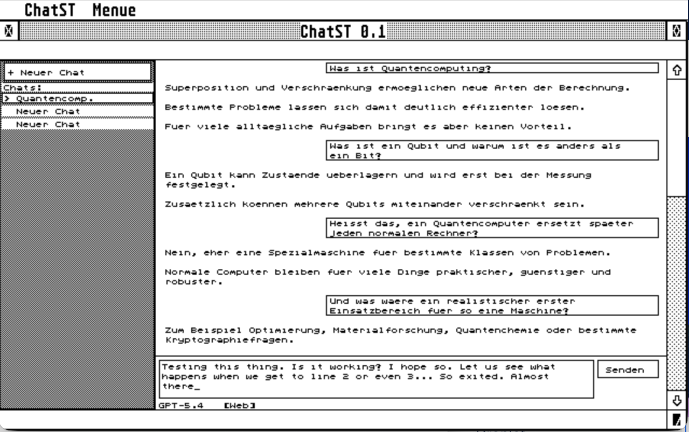
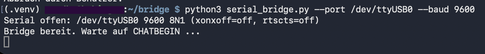
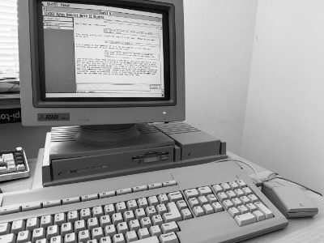

# A ChatGPT Client for Atari ST (in GFA Basic 3.5)

I have been building a GEM-based LLM chat client for the Atari ST in [GFA BASIC](https://en.wikipedia.org/wiki/GFA_BASIC) 3.5E. What if an Atari ST could talk to a modern LLM? Not a fake retro skin in a browser, no emulator (though I love [Hatari](https://www.hatari-emu.org)!), but my actual old Atari Mega STE. 
GFA BASIC was developed by [Frank Ostrowski](https://en.wikipedia.org/wiki/Frank_Ostrowski) in 1986 and was hugely popular among ST users at the time. So I chose it in the hope that there might be still some resources out there. Did I learn GFA Basic properly for this project? No, but i dug out all the [old docs](https://gfabasic.net/stg/gfabasic.htm) and [books](https://archive.org/details/das-grosse-gfa-basic-3.0-buch/) and forced codex to learn it. Ha,ha. Poor thing. 

The setup :
- Atari Mega STE in high-res monochrome
- GFA BASIC 3.5E on the Atari side
- Raspberry Pi and python 3.12 on the other side
- Nullmodem serial cable (StarTech 30cm USB Nullmodem Seriell Adapterkabel, USB-A auf RS232 DB9)



I did not want to run networking code on the Atari itself. The Atari app should stay small, understandable, and debug-friendly. So the split became: Atari: UI, chat history, keyboard handling, rendering, serial send/receive. Raspberry Pi: serial parsing, HTTP API calls, environment variables, debugging. That turned out to be the right decision. It kept the Atari side primitive in a good way.

## Teaching Codex GFA BASIC



One fun part of the project was that Codex had to learn a language that is not exactly a mainstream 2026 target. While planing and coding was fun, the debugging was really something. Also, the IDE wasn't all that comfortable. GFA BASIC has some sharp edges:

- source files in "-LST" format need line endings as `CRLF`. Code goes into GFA Basic best using  `MERGE`
- `GOSUB` wants `PROCEDURE`, not random labels
- `missing Procedure` often does not actually mean a procedure is missing. Mostly we messed up loop endings.

We spent a surprising amount of time learning what *not* to do: no Unix line endings, no overly clever one-line statements, no `DIM` for ordinary string variables. Avoid control-flow tricks that would be fine in a modern language. Reduce the number of helper procedures when GFA starts getting mysterious.

## A tiny serial protocol

I originally considered XML-ish tags like `<MSG>` and `<RESP>`, but that quickly felt too fragile. The format we ended up with is block-based and length-prefixed:

Atari to Raspberry Pi:

```txt
CHATBEGIN
MSG user 5
Hello
MSG assistant 3
Hi!
CHATEND
```

Raspberry Pi back to Atari:

```txt
ANS 42
SSH is a secure protocol for remote access.
```

- ASCII-only
- easy to inspect in a terminal
- no escaping layer
- payload length decides where content ends
- robust enough for noisy serial debugging

The Atari sends the whole conversation history each time, and the Pi turns that into an API request. With 9600 bps it works fine - if you are a bit patient.

## A tiny chat file format

I also wanted local chat history on disk to be able to store multiple chats. I needed something the Atari could parse without pain. So the local `.CHT` files are also simple and length-based. The UI rebuilds the wrapped display lines from the raw message text each time.  I started out on Hatari and moved over to the real hardware once the basic GUI was done.



## The serial link

The serial link itself was half the battle. A few real-world gotchas: The Pi had to stop running `serial-getty` on the same port (witch is great when you just want a terminal in your atari terminal program). `/dev/ttyUSB0` permissions needed fixing



Once those were sorted out, a minimal serial test program on the Atari was enough to prove that typed text and returned bytes were really making the round trip. After that, integrating the protocol into the GUI was the next step.

## The current result

The current app has:

- a (clunky) GEM-style windowed UI
- scrollable message area
- variable size input field
- sidebar with multiple chats
- serial round-trip to the Raspberry Pi bridge
- live OpenAI responses on a real Atari ST-class machine

*Of course this is only a party trick. No real GFA programmers were harmed (or involved). Still, there is something deeply satisfying about connecting worlds that were never supposed to meet.* 



## How to run it

On the Raspberry Pi side:

- copy `serial_bridge.py`
- copy the `.env` file
- adjust `OPENAI_API_KEY` and `OPENAI_BASE_URL` in `.env`

Then:

```bash
sudo setfacl -m u:user:rw /dev/ttyUSB0
python3 serial_bridge.py --port /dev/ttyUSB0 --baud 9600
```

(Replace user with your username on the raspi)

The Atari side is pleasantly low-tech:

- connect the adapter to the Atari serial port and to a USB-A port on the Raspberry Pi
- get a copy of GFA BASIC 3.5 for Atari ST (It's out there)
- start with an empty program
- use `Merge` to load `ACHAT01.LST`
- run it

